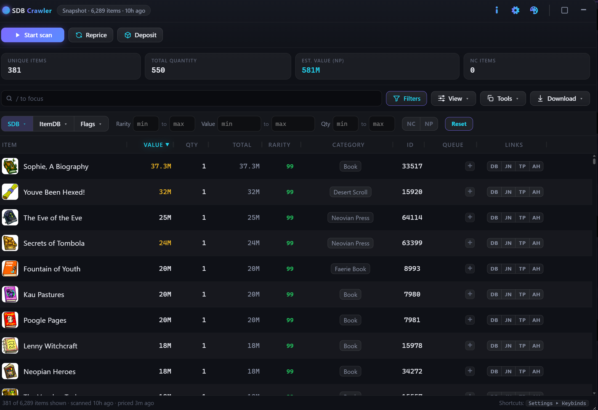
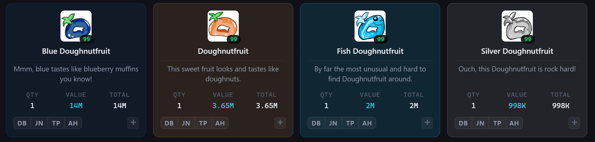
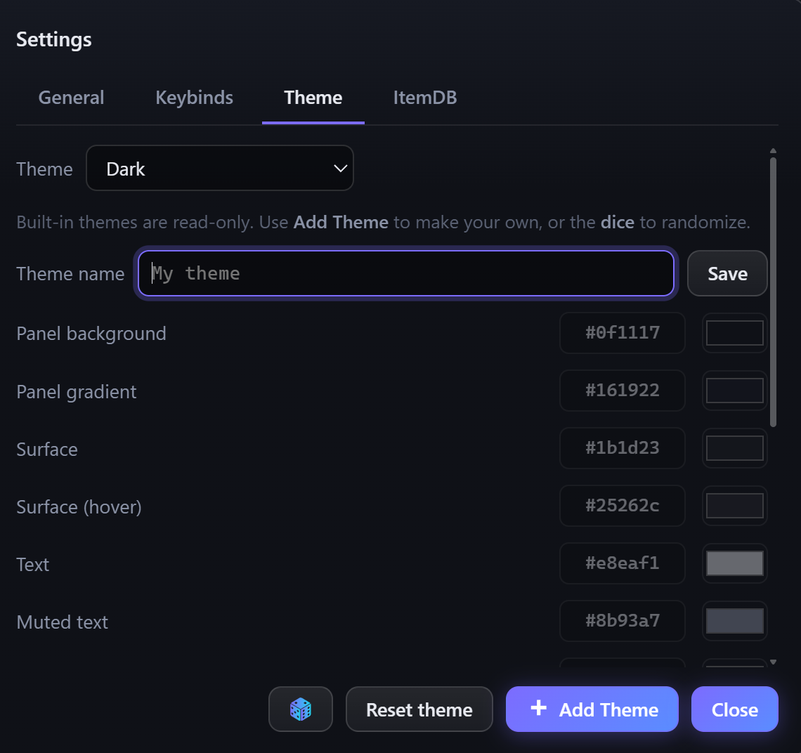

# SDBCrawler

**A high-performance, resizable SDB management utility for Neopets with item logging, valuation, filters, and batch item management.**

![SDBCrawler](https://img.shields.io/badge/SDB-Crawler-7c6cff?logo=data:image/svg+xml;base64,PHN2ZyB4bWxucz0iaHR0cDovL3d3dy53My5vcmcvMjAwMC9zdmciIHZpZXdCb3g9IjAgMCAyMDAgMjAwIj48ZGVmcz48bGluZWFyR3JhZGllbnQgaWQ9ImciIHgxPSIwIiB5MT0iMCIgeDI9IjEiIHkyPSIxIj48c3RvcCBvZmZzZXQ9IjAiIHN0b3AtY29sb3I9IiM3YzZjZmYiLz48c3RvcCBvZmZzZXQ9IjEiIHN0b3AtY29sb3I9IiMyMmQzZWUiLz48L2xpbmVhckdyYWRpZW50PjwvZGVmcz48cGF0aCBmaWxsPSJ1cmwoI2cpIiBkPSJNMTk5Ljk4IDEwMkguMDJhMTAwLjAxNyAxMDAuMDE3IDAgMDAzLjM5MyAyNGgxOTMuMTc0YTEwMC4wMjggMTAwLjAyOCAwIDAwMy4zOTMtMjR6TTE5NS40MjIgMTMwSDQuNTc4YTk5LjQ0OCA5OS40NDggMCAwMDguOCAyMGgxNzMuMjQ0YTk5LjQ1IDk5LjQ1IDAgMDA4LjgtMjB6TTE4NC4xODEgMTU0SDE1LjgxOWExMDAuNDc0IDEwMC40NzQgMCAwMDEyLjc2NyAxNmgxNDIuODI4YTEwMC40MzEgMTAwLjQzMSAwIDAwMTIuNzY3LTE2ek0xNjcuMjYyIDE3NEgzMi43MzhhMTAwLjI2NyAxMDAuMjY3IDAgMDAxOS43MjQgMTRoOTUuMDc2YTEwMC4yODkgMTAwLjI4OSAwIDAwMTkuNzI0LTE0ek0xMzkuMjU3IDE5Mkg2MC43NDNjMTIuMDUyIDUuMTUgMjUuMzIyIDggMzkuMjU3IDggMTMuOTM1IDAgMjcuMjA1LTIuODUgMzkuMjU3LTh6TTE5OS45OCA5OEguMDJhOTkuNzUzIDk5Ljc1MyAwIDAxNS41NTMtMzFoMTg4Ljg1NGE5OS43MjMgOTkuNzIzIDAgMDE1LjU1MyAzMXpNMTkyLjkzMiA2M0MxNzguMjIzIDI2LjA4NyAxNDIuMTU4IDAgMTAwIDBTMjEuNzc3IDI2LjA4NyA3LjA2OCA2M2gxODUuODY0eiIvPjwvc3ZnPg==&logoColor=white)

---

SDBCrawler is a userscript that logs and prices your entire Safety Deposit Box into a fast virtualized grid that you can then filter, sort, and move items with.
It is written in vanilla JavaScript, so everything runs in your browser. No dependencies or external packages are required, only a userscript manager.

---

## Contents

- [Features](#features)
- [Install](#install)
- [Getting started](#getting-started)
- [Finding items](#finding-items)
- [Moving items](#moving-items)
- [Snapshots &amp; Activity](#snapshots--activity)
- [Export &amp; backup](#export--backup)
- [View Options &amp; Themes](#view-options--themes)
- [Keyboard shortcuts](#keyboard-shortcuts)
- [Credits &amp; license](#credits--license)

---

## Features

- **Live grid.** Scan once into a virtualized grid; it updates in place as you move or deposit when you use the built-in deposit and movement features, no page reload.
- **Activity log.** Activity log with expandable entries for recent moves and deposits.
- **Custom themes.** Five built-in palettes plus a full theme editor.
- **Adds Values to SDB Items.** NP prices and inflation flags from [itemdb](https://itemdb.com.br), NC values from [Lebron Values](https://stylisher.club). Unpriced items read `?` (itemdb has no price) versus a dim `–` (not fetched yet).
- **Export &amp; backup.** Download the current view as HTML, Excel, CSV, or JSON, or take a full data backup you can import on another device, moving your data across without re-scanning or re-logging.
- **Search &amp; filters.** Wildcard, compound, and negation search, plus tri-state category and flag filters and rarity / value / quantity ranges.
- **Batch moves.** Queue items and send them to your inventory, shop, or gallery in bulk; items on the same SDB page move in a single request. Deposit your whole inventory in one action.
- **Snapshots.** Capture the box over time and diff what was added, removed, or changed, or watch the total-value trend.

---

## Install

1. If you do not already have one, install a userscript manager such as: [Tampermonkey](https://www.tampermonkey.net/), [Violentmonkey](https://violentmonkey.github.io/)
2. Click to install the script:

   **[⬇ Install SDBCrawler](https://raw.githubusercontent.com/TamperPanda/SDBCrawler/main/SDBCrawler.user.js)**

   Your userscript manager should open its install/confirm screen automatically.
3. Go to your [Safety Deposit Box](https://www.neopets.com/safetydeposit.phtml). The SDBCrawler launcher appears on the page; click it to open the panel. The in-app guide opens once on first run. The launcher is repositionable and will snap to the four corners and midpoints.

Updates are delivered through the same URL; if you have auto-update enabled, the script will update automatically.

> **itemdb pricing needs a session cookie:** Visit [itemdb](https://itemdb.com.br) in the same browser before pricing. A visit authorizes prices for 24 hours; signing in lasts two weeks.

---

## Getting started

1. **Scan.** Press **Start scan** to crawl your whole SDB into the grid.
2. **Get prices.** Make sure **itemdb prices** is on (Settings ▸ itemdb) and that you have opened [itemdb](https://itemdb.com.br) in the same browser. Prices fill in as the scan runs; hit **Reprice** any time to refresh loaded items without re-scanning. Detail level (Settings ▸ itemdb) is **Pricer** by default; **Full** additionally fetches the openable flag.
3. **Find what you want.** Type in the search box (`/` focuses it), or use the category and flag filters and the rarity / value / quantity ranges. Click any column heading to sort.
4. **Queue &amp; move.** Add items to the queue, choose **Send to** (Inventory / Shop / Gallery), and press **Move**. **PIN** is entered once per visit if your account requires one; it is not saved, so navigating away means re-entering it.
5. **Deposit.** Use **Deposit** to send your whole inventory to your SDB; deposited items appear in the activity log.

Hover almost any button for a one-line description of what it does. If itemdb rate-limits you mid-scan, a "price the unpriced" button (the same ↻ refresh icon) appears; use it instead of Reprice to fill just the gaps.

---

## Finding items

**Search** matches an item's name, category, and ID, so typing a category name filters to it. It supports:

| Token | Meaning | Example |
|---|---|---|
| `*` | match any run of characters | `magical * plushie` (same result as `magical & plushie`) |
| `?` | match a single character | `neg?` |
| `&` | all terms must match | `blue & potion` |
| `!` | exclude | `codestone & !plushie` |

**Filters:**

- **SDB categories** and **itemdb categories** are separate tri-state menus. Click once to include, again to exclude, a third to clear. *Within* a menu, includes are OR (match any selected). *Across* different menus, and when combined with flags, filters are AND (an item must satisfy each). So pairing a category with a flag narrows well; combining the two category menus is an intersection and rarely what you want. Both menus are searchable.
- **Flags:** Inflated, ETS (easy to sell), HTS (hard to sell), and Openable. Openable only appears when the data carries it (full itemdb data setting).
- **Hidden**, the **NP/NC** currency toggle, and **rarity / value / quantity**
- **Reset filters** clears everything, including the search box.

Click any item's image to copy its name.
Click any column heading to sort, and again to reverse. Drag a column's header to resize it; double-click will reset its width.
In Cards view, use the **Sort by** dropdown.

---

## Moving items

- Click `+` on a row to queue one; **Shift-click** it to queue the whole stack (the `−` button mirrors this).
- Click a queued chip to unqueue it; the list button opens the full queue to adjust quantities or remove entries.
- **Clear queue** removes all items from the queue. The queue syncs across tabs.
- Filter down to what you want, then queue the whole view at once: **Queue Filtered** (instant) and **Queue filtered + Review** are both bindable in Settings ▸ Keybinds.
- **Paste list** (Tools): paste item names one per line, optionally with a quantity after a comma or tab. **Copy Names** can be used to quickly add one of each filtered.
- **Send to:** Choose a destination (Inventory, Shop, or Gallery) from the dropdown, then press **Move**.
- **Deposit** sends your entire inventory into the Safety Deposit Box in batches (70 items per request). Deposited items are added to the activity log and priced automatically; their details and images are backfilled from the SDB, so image thumbnails and descriptions appear even if itemdb is rate-limited. **Stop** ends a run cleanly between batches.

### Hiding rows

Turn on **edit mode** (in the view menu) to reveal each row's hide and remove controls. Hiding a row only affects this list and is reversible by unhiding. The delete button removes an item from the current log, but rescanning will bring it back. Shift-click the **Hidden** toggle to unhide everything at once.

---

## Snapshots &amp; Activity

- **Snapshots** save a copy of the box state. Diff the current box against any saved snapshot to see what was added, removed, or changed (with per-unit deltas), or view the trend of total value over time. A snapshot is captured automatically after every complete scan, so the value trend builds itself. Only the most recent 12 snapshots are saved.
- **Activity** logs your recent moves and deposits (the last 25), each entry expandable, with per-item value on deposits.
- **Copy names** copies the filtered item names, one per line, ready for a Paste list.

---

## Export &amp; backup

- **Download** the current view as **Excel, HTML, CSV, or JSON**. The HTML export is a standalone offline viewer with the same search, category/flag filters, and sorting as the live panel (range filters and Cards view stay in-app).
- **Copy as TSV** (Tools menu, or bind a key) copies the current view for pasting into a spreadsheet.
- **Backup / restore** (Settings ▸ General ▸ Manage Data): **Export a Backup** saves a full JSON of settings and data; **Import Backup** loads it straight back and reloads. This is the easy way to move everything to another device without re-scanning or re-logging.

---

## View Options &amp; Themes

- **Rows / Cards** and **Scroll / Paged** view modes. Cards show a description, rarity accent, an optional colour tint sampled from the item image (no fetch), and compact numbers (hover for exact).
    

    
    

- **Grid zoom** (View ▸ Zoom, 50–150%) scales the data grid on its own, separate from the controls. SDBCrawler picks a starting zoom from your screen; try adjusting it if the columns look too spread out or cramped after you resize the panel. 
- Drag the header to move the panel. Filters, themes, column widths, panel position, and zoom are all remembered.
- Pick a built-in theme from the header palette menu, or build your own in Settings ▸ Theme (live preview, save, delete, rename). An unsaved palette shows as **Custom (unsaved)**. You can use any theme as a starting point for customizing your own by having it in use when you go to the theme maker.
- Clicking the dice rolls a random theme that you can save or edit.

    

    
    

---

## Keyboard shortcuts

Two shortcuts are bound by default:

| Shortcut | Action |
|---|---|
| **Shift + `+`** | Toggle the panel |
| `/` | Focus the search box |

Every other action is unbound by default, assign your own in <b>Settings ▸ Keybinds</b> (click to expand)

- Queue Filtered (instant)
- Queue filtered + Review
- Move the queue
- Start scan
- Reprice
- Deposit inventory
- Stop
- Open filters
- Snapshots
- Activity log
- Copy current view
- Copy view as TSV
- Paste list
- Download menu
- Rows view
- Cards view
- Maximize / restore
- Open settings
- Close panel

---

## Credits &amp; license

Found a bug or have a feature idea? Open an issue on the [GitHub repository](https://github.com/TamperPanda/SDBCrawler/issues).

- Item data and NP prices from **[itemdb](https://itemdb.com.br)**.
- NC values from **[Lebron Values](https://stylisher.club)**. NC pricing is sourced here rather than through itemdb, which also keeps NC valuation off itemdb's rate limit.

SDBCrawler is an unofficial fan tool; this project is not affiliated with or endorsed by Neopets.

### License

This project is licensed under the [MIT License](LICENSE).